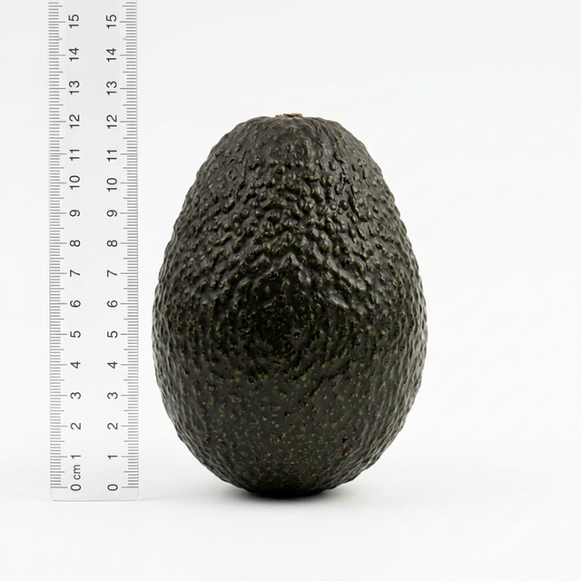

# 🥑 Week 03: Volume & Surface Area Estimation via Numerical Integration
**– [Cubic Spline](https://docs.scipy.org/doc/scipy/reference/generated/scipy.interpolate.CubicSpline.html) Interpolation, [Simpson](https://docs.scipy.org/doc/scipy/reference/generated/scipy.integrate.simpson.html)/[Trapezoidal](https://docs.scipy.org/doc/scipy/reference/generated/scipy.integrate.trapezoid.html) Integration Algorithms & 3D Visualization –**

> 📂 **Navigate**: [← Week 02: Circularity & Sphericity](../week2/week02_lab_circularity_sphericity.md) · [Main README](../README.md) · [📝 Quiz Bank](../QUIZ_BANK.md)

---

## 0. Sample Reference: Avocado Specimen

This lab estimates the volume and surface area of the avocado specimen shown below, using lengthwise profile (radius) data and numerical integration.



| Parameter | Value |
|-----------|-------|
| Variety | Hass |
| Total Length | 10.85 cm |
| Maximum Radius | 3.38 cm (at x = 6.5 cm) |
| Measurement Points | 6 (x = 0, 1.0, 5.0, 6.5, 8.0, 10.85 cm) |

> 📏 **Scale Reference**: The centimeter ruler in the photo provides real-world size context. Profile data is cited from textbook Example 3-3.

---

## 1. Theoretical Background: Volume, Surface Area & Bio-resource Processing

### 1-1. Engineering Significance of Volume & Surface Area
- **Surface Area**: Boundary condition for heat and mass transfer equations in drying/cooling processes
- **Volume**: Core parameter for storage facility design and density calculations
- **Specific Surface**: Higher specific surface → faster drying rate under same conditions
  - e.g., Wheat (1,316 m⁻¹) > Corn (728 m⁻¹) > Soybean (558 m⁻¹)

### 1-2. Connection with [Week 02](../week2/week02_lab_circularity_sphericity.md) Content
- **[Week 02](../week2/week02_lab_circularity_sphericity.md)**: [Circularity](https://en.wikipedia.org/wiki/Shape_factor_(image_analysis_and_microscopy)), [Sphericity](https://en.wikipedia.org/wiki/Sphericity) — **static shape indices**
- **Week 03**: Volume, Surface Area — extension to **dynamic physical quantities**
- High [sphericity](../week2/week02_lab_circularity_sphericity.md#1-2-sphericity--roundness) (e.g., apple) → simple formulas yield accurate volume estimates
- Low sphericity (e.g., rice grain) → requires more sophisticated [numerical integration](https://en.wikipedia.org/wiki/Numerical_integration) models

### 1-3. Physical Measurement Methods & Their Limitations
| Method | Applicable Samples | Principle | Limitation |
| --- | --- | --- | --- |
| **Liquid Displacement** (water) | Potato, avocado, etc. | [Archimedes' principle](https://en.wikipedia.org/wiki/Archimedes%27_principle) | Unsuitable for moisture-absorbing samples |
| **Air Pycnometer** | Grains (rice, wheat, etc.) | [Boyle's Law](https://en.wikipedia.org/wiki/Boyle%27s_law) | Air compressibility & friction errors |
| **Peel Area Measurement** | Fruits | Area meter after peeling | Destructive, non-reproducible |

### [Summary: Segmental Modeling]
Subdivide irregularly shaped bio-resources into hemispheres, truncated cones, spherical caps, etc. — automatable via Python numerical integration

---

## 2. Theoretical Basis of Numerical Integration Algorithms

### 2-1. Volume of Revolution
Volume of the solid formed by rotating the profile function `r(x)` about the central axis:
```
V = π ∫₀ᴸ r(x)² dx
```

### 2-2. Surface Area of Revolution
```
S = 2π ∫₀ᴸ r(x) × √(1 + (dr/dx)²) dx
```

### 2-3. Numerical Integration Comparison
| Method | Approximation | Accuracy | SciPy Function |
| --- | --- | --- | --- |
| **[Trapezoidal Rule](https://en.wikipedia.org/wiki/Trapezoidal_rule)** | Linear (1st order) | O(h²) | [`scipy.integrate.trapezoid`](https://docs.scipy.org/doc/scipy/reference/generated/scipy.integrate.trapezoid.html) |
| **[Simpson's Rule](https://en.wikipedia.org/wiki/Simpson%27s_rule)** | Parabolic (2nd order) | O(h⁴) | [`scipy.integrate.simpson`](https://docs.scipy.org/doc/scipy/reference/generated/scipy.integrate.simpson.html) |

---

## 3. Python Algorithm: Split Tutorial

This lab is organized into **3 separate Python files** so students can execute each step sequentially and visually understand the progressive results.

### 📝 [Required] Lab Environment Setup & Code Execution Instructions
1. **Install Packages**: Open your command prompt (cmd) or VS Code terminal and install the required libraries:
   ```bash
   pip install numpy scipy matplotlib
   ```
2. **Create or Open Code Files**: Open each of the files described in Sections 3-1, 3-2, and 3-3 below in your editor.
3. **Run Scripts Sequentially**: Enter the following commands one by one in your terminal to observe how the results change at each stage. Close the plot window (press **X** button) to proceed.
   ```bash
   python step1_interpolation.py
   python step2_volume.py
   python step3_3d_visualization.py
   ```

---

### 3-1. [`step1_interpolation.py`](step1_interpolation.py): Profile Data Input & Cubic Spline Interpolation
Input the avocado's lengthwise radius measurements from textbook Example 3-3, and generate a smooth profile curve using Cubic Spline interpolation.

```python
import numpy as np
from scipy.interpolate import CubicSpline
import matplotlib.pyplot as plt

# Avocado example data (position x [cm], radius r [cm])
x_points = np.array([0, 1.0, 5.0, 6.5, 8.0, 10.85])
r_points = np.array([0, 1.47, 3.185, 3.38, 3.04, 0])

# Cubic Spline Interpolation for a smooth continuous curve
cs = CubicSpline(x_points, r_points, bc_type='natural')
x_new = np.linspace(0, 10.85, 100)
r_new = cs(x_new)
r_new = np.maximum(r_new, 0)  # Correct negative radii

# Visualization: measured points vs. interpolated curve (symmetric cross-section)
plt.fill_between(x_new, r_new, -r_new, alpha=0.3, color='green')
plt.plot(x_points, r_points, 'ro', markersize=8, label='Measured Data')
plt.title('Avocado Profile - Cubic Spline Interpolation')
plt.xlabel('Length x [cm]'); plt.ylabel('Radius r [cm]')
plt.legend(); plt.grid(True, alpha=0.3); plt.axis('equal')
plt.show()
```

**[Learning Points]**
- Observe how 6 discrete points are transformed into 100 continuous points
- Visually compare linear interpolation (straight lines) vs. cubic spline (smooth curves)

---

### 3-2. [`step2_volume.py`](step2_volume.py): Volume Estimation via Numerical Integration
Using the interpolated profile function `r(x)`, compute the cross-sectional area `A(x) = π × r(x)²` at each position, then calculate the volume using Simpson's Rule and Trapezoidal Rule.

```python
from scipy.integrate import simpson, trapezoid

# Cross-sectional area (A = π × r²)
areas = np.pi * (r_new ** 2)

# Volume via Simpson's Rule
vol_simpson = simpson(areas, x=x_new)
print(f"Estimated Volume (Simpson's Rule): {vol_simpson:.4f} cm³")

# Volume via Trapezoidal Rule
vol_trapezoid = trapezoid(areas, x=x_new)
print(f"Estimated Volume (Trapezoidal Rule): {vol_trapezoid:.4f} cm³")
```

**[Learning Points]**
- Vary the number of subdivisions (n): 10 → 20 → 50 → 100 → 1000) and observe error convergence
- Discuss why Simpson's Rule provides higher accuracy than Trapezoidal at the same subdivision count
- Compare textbook manual calculation (5 segments) vs. Python integration (100+ segments)

---

### 3-3. [`step3_3d_visualization.py`](step3_3d_visualization.py): 3D Surface Reconstruction & Visualization
Intuitively observe the transformation from 2D profile data to a 3D solid using Matplotlib's mplot3d toolkit.

```python
from mpl_toolkits.mplot3d import Axes3D

theta = np.linspace(0, 2 * np.pi, 50)
X, THETA = np.meshgrid(x_new, theta)
Y = cs(X) * np.cos(THETA)
Z = cs(X) * np.sin(THETA)

fig = plt.figure(figsize=(10, 8))
ax = fig.add_subplot(111, projection='3d')
ax.plot_surface(X, Y, Z, cmap='YlGn', alpha=0.8)
ax.set_title(f"Reconstructed 3D Shape of Avocado (V={volume:.1f} cm³)")
plt.show()
```

**[Learning Points]**
- Observe how well your algorithm approximates the actual avocado shape
- Discuss the impact of surface irregularity on integration results
- Examine the surface area calculation: `S = 2π ∫ r(x) × √(1 + (dr/dx)²) dx`

---

### [Lab Discussion Points]

#### A. Convergence of Numerical Integration
- As subdivision count n increases, the difference between Simpson and Trapezoidal converges to zero
- n ≥ 100 is sufficient for most agricultural product shapes

#### B. Impact of Interpolation Method on Results
- Linear interpolation: simple computation but unnatural surface representation
- Cubic spline: smooth curves that better approximate actual bio-resource shapes

#### C. Connection to Week 04 (Density)
- Volume data from this lab forms the foundation for Week 04's true density and bulk density calculations
- `Density = Mass / Volume` — accurate volume estimation determines density accuracy

---

## 4. 💡 Advanced Discussion Topics

### Discussion 1: Limitations of Geometric Simplification & Vision-Based Measurement Algorithms

**Background**: When manually computing volume and surface area by dividing an avocado into 5 segments (spherical caps and truncated cones) as in textbook Example 3-3, structural errors of approximately 8.03% for surface area and 4.33% for volume were observed compared to actual measurements (e.g., water displacement). In contrast, the Python lab subdivides the object into 100+ micro-segments and applies numerical integration (Simpson's Rule, etc.).

> **Discussion Prompt**: Beyond simply increasing the number of subdivisions (n), what are the fundamental **'asymmetry limitations'** of single-view 2D profile rotation integration in Python, and how can these be addressed using modern 3D digital metrology (3D scanning, stereo vision, etc.)?

### Discussion 2: Impact of Specific Surface Area on Processing Operations

**Background**: Specific surface area — the ratio of surface area to volume — has a decisive influence on heat and mass transfer rates. Research shows that wheat (1,316 m²/m³), with its high specific surface, loses moisture significantly faster than soybeans (558 m²/m³) under identical drying conditions.

> **Discussion Prompt**: Applying this physical property of specific surface area, what engineering strategies should be adopted when designing cooling and ventilation systems for storage facilities (silos) that must hold large quantities of fruits or grains for extended periods?

### Discussion 3: Volume Measurement for Moisture-Absorbing Resources — Liquid Displacement vs. Air Pycnometer

**Background**: Materials with low moisture permeability (such as potatoes and apples) can be accurately measured using water displacement based on Archimedes' principle. However, grains that rapidly absorb moisture require an air pycnometer based on Boyle's Law.

> **Discussion Prompt**: When measuring with a sensor-integrated air pycnometer, beyond air compressibility and piston friction, what impact could **'temperature changes'** within the chamber have on measurement precision, and what cross-validation methods can improve data reliability?

---

## 5. 📝 Quiz Questions

### Q1. [Theory] Primary Source of Error in Segmental Modeling
What is the **most significant cause** of error when applying 'segmental modeling' to calculate the volume of irregularly shaped agricultural products?

| Option | Content |
| --- | --- |
| A | Differences in internal moisture content of the bio-resource |
| B | Errors in numerical integration formulas |
| **C** | **Geometric assumptions that simplify the natural curvature and asymmetry of bio-resource surfaces into perfect mathematical shapes (truncated cones, spherical caps, etc.)** |
| D | Quantization errors from calipers used during measurement |

<details>
<summary>View Answer & Explanation</summary>

**Answer: C**  
Because the continuous, fine curvature of a real avocado is simplified (approximated) by linearizing it into shapes like truncated cones, geometric distortion occurs (surface area error ~8.03%, volume error ~4.33%).
</details>

### Q2. [Lab - Python] Preprocessing Interpolation Technique
The 2D contour data points obtained from the apple in Week 02 are discrete. What is the name of the **'preprocessing interpolation technique'** used in the Week 03 lab to smoothly connect these points into a mathematical function curve for improved integration precision?

<details>
<summary>View Answer & Explanation</summary>

**Answer: Cubic Spline Interpolation**  
Using SciPy's `CubicSpline`, measured data points are converted into 100+ smooth polynomial curve points, enabling accurate integration for 3D solid-of-revolution estimation.
</details>

### Q3. [Lab - Python] Numerical Integration Formula Comparison
When computing the volume of a solid of revolution using SciPy's numerical integration library, which function (integration formula) provides higher precision than the `trapezoid` function by approximating intervals with **2nd-order parabolas**, making it especially suitable for curved agricultural product analysis?

<details>
<summary>View Answer & Explanation</summary>

**Answer: Simpson's Rule (`scipy.integrate.simpson`)**  
The Python lab implements and compares both the Trapezoidal Rule and Simpson's Rule. Simpson's Rule is mathematically advantageous for estimating the volume of organic curved surfaces.
</details>

### Q4. [Theory] Physical Law Behind the Air Pycnometer
Because grains swell easily in water, an 'Air Pycnometer' — which uses two sealed cylinders and a pressure gauge — is used instead of water displacement for volume measurement. What is the **fundamental physical law** this instrument applies to relate volume and pressure?

<details>
<summary>View Answer & Explanation</summary>

**Answer: Boyle's Law**  
Based on the principle that at constant temperature, gas pressure and volume are inversely proportional, this method precisely calculates the absolute volume occupied by the sample.
</details>

---

## 6. Version Control & GitHub Submission Guide

*This course requires students to accumulate weekly assignments in a single master repository.*  
*For detailed instructions on initial GitHub setup and assignment submission (push), please refer to the **[Integrated Lab Submission Guide](../README.md)** in the top-level directory.*
