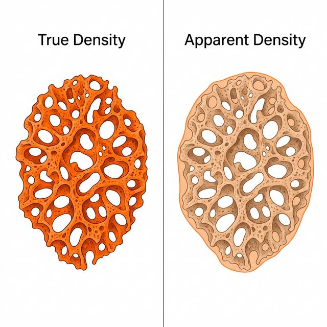
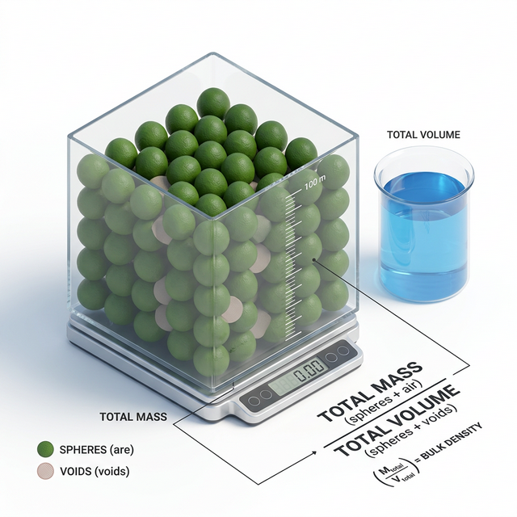
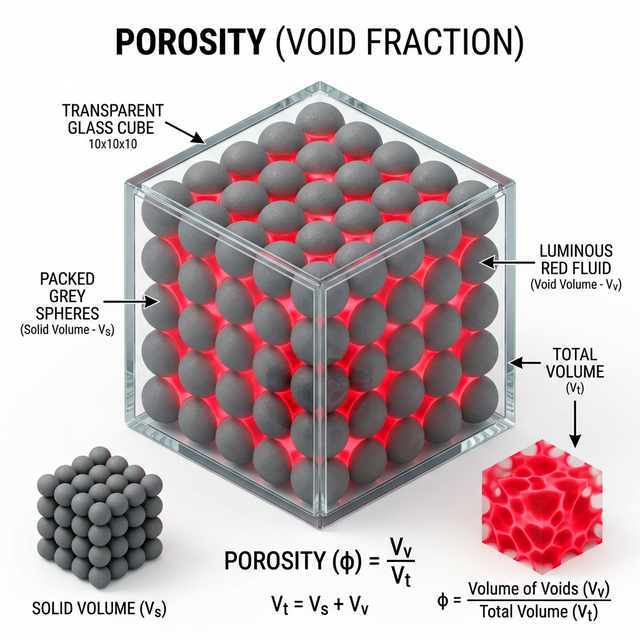
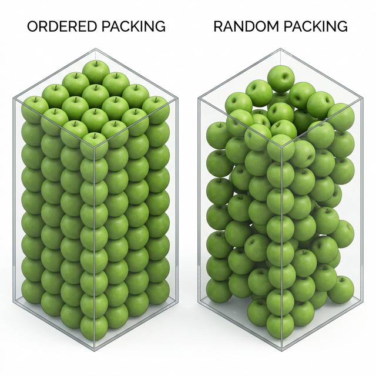

# 🥑 Week 4: Density & Porosity Lab for Agricultural Materials
**– Computing Physical Properties and Virtual 3D Packing Simulation –**

> 📂 **Navigation**: [← Week 3: Volume & Surface Area](../week3/03주차_실습_체적_표면적.md) · [Main README](../../README.md) · [📝 Quiz Bank](../../QUIZ_BANK.md)

---

## 0. Target Data: Continuation from Week 3

This week's lab utilizes the numerical integration volume data from Week 3, combined with simulated mass and packaging box properties.

| Parameter | Data Value |
|-----------|------------|
| Specimen | Avocado (Hass variety) |
| Individual Volume | 205.4 cm³ (from Week 3 Simpson's integration) |
| Individual Mass | 215.0 g (Assumed scale measurement) |
| Standard Packaging Box | 40cm (W) × 30cm (D) × 15cm (H) (Total Vol: 18,000 cm³) |
| Box Capacity | 45 units per box |

---

## 1. Theoretical Background: Significance of Density and Porosity

### 1-1. True Density & Apparent Density


- **Concept**:
  - `True Density`: The pristine density of the solid material excluding all internal micro-pores and closed voids.
  - `Apparent Density`: The density representing the complete external envelope of the particle, including any internal pores.
- **Applications**: Quality grading, aerodynamic sorting (e.g., wind extraction), mass-to-volume estimations
- **Lab Integration**: For most fruits and vegetables, internal pores are negligible, so we merge both concepts and refer to them collectively as 'Particle Density'

### 1-2. Bulk Density


- **Concept**: Ratio of the total mass of biological materials to the entire volume of their enclosing container
- **Applications**: Designing capacities of silos and logistics warehouses; calculating payload limits for transport trucks
- **Characteristics**: Highly dependent on packing method, compaction cycles, and particle shape

### 1-3. Porosity


- **Concept**: The proportion of void volume relative to the total bulk volume
- **Applications**: Assessing airflow resistance during hot-air drying; predicting gas permeability for fumigation treatments; designing heat dissipation
- **Calculation Methods**:
  - `Density Ratio Strategy` = 1 - (Bulk Density / Particle Density)
  - `Volume Subtraction Strategy` = (Void Volume / Box Volume)

---

## 2. Python Algorithm Lab: Computing Density and Porosity

This module covers a complete Python pipeline scaling from individual properties to population properties, along with 3D visualization.

### 📝 [Mandatory] Environment Setup & Execution Guide
1. **Package Installation**: Install required libraries via terminal
   ```bash
   pip install numpy matplotlib scipy
   ```
2. **File Locations**: `week4/step1_density_porosity.py`, `week4/step2_advanced_apple.py`, and `week4/step3_random_packing.py`
3. **Execution**: Run the Python scripts iteratively
   ```bash
   python step1_density_porosity.py    # Baseline Avocado Lab
   python step2_advanced_apple.py      # Advanced Apple Lab (after filling variables)
   python step3_random_packing.py      # Virtual 3D Packing Simulation (Ordered vs Random)
   ```

---

### 📊 Python Script Key Highlights (Steps 1 ~ 3)

#### 2-1. [Step 1] Particle Density
- Individual density computation via mass and volume inputs
- Computed value exceeds water density (1.0 g/cm³) → Sink behavior expected during washing processes

#### 2-2. [Step 2] Bulk Density (Packed Cargo)
- Calculation of total mass within the container (Unit mass × Totals)
- Assessment against the total physical volume of the plastic box

#### 2-3. [Step 3] Porosity Cross-validation
- Systematic comparison of two distinct mathematical approaches
- Verification confirming identity between `Density Ratio` formula and `Physical Volume Subtraction` formula

#### 2-4. [Step 1 Visuals] Unified Data Visualization
- **3D Virtual Packing (Scatter)**: Spatial arrangement of 45 avocados and direct visualization of void spaces
- **Density Gap Analysis (Bar Chart)**: Numerical contrast between Particle vs. Bulk Density
- **Occupancy Analysis (Pie Chart)**: Ratio of actual avocado volume versus porosity allocations

#### 2-5. [Step 3] Virtual Packing Simulation Comparison (Ordered vs Random)


- **Objective**: Mathematically model and contrast the fitting capacity difference between an 'Ordered Grid' pattern and haphazardly pouring objects via 'Random Packing'.
- **Algorithm Mechanism**: Implemented Monte Carlo coordination generators paired with spatial collision detection (`scipy.spatial.distance.cdist`) to prevent intersection.
- **Outcome Assessment**: Direct 3D visualization illustrating the severe drop in capacity when produce randomly falls into a box compared to uniform stacking → **Empirical demonstration of Bulk Density collapse sans systematic arrangement/compaction**.

#### 2-6. 🚀 [Advanced] Target Swap Exercise: Applying Apple Data
- **Objective**: Adapt the baseline script to compute physical properties of a different agricultural product
- **Assignment**: Replace the baseline avocado variables with the apple data below, execute `step2_advanced_apple.py`, and analyze the outcomes
  - Individual Volume (`volume_single_cm3`): **315.0 cm³** (Reference: Week 2 Apple)
  - Individual Mass (`mass_single_g`): **280.0 g**
  - Loaded Object Count (`apple_count`): **24 units**
- **Observation Points**: Shift in Particle Density (flotation vs. sink behavior) and fluctuations in Porosity values based on the morphological difference

---

## 3. 💡 Advanced Discussion Topics

### Topic 1: Correlation Between Shape and Porosity
- **Background**: Perfectly spherical fruits yield vastly different void architectures compared to irregularly shaped produce when packed.
- **Prompt**: If avocados were replaced with highly spherical 'Tomatoes' or elongated 'Bananas' within the identical box dimensions, how would porosity statistics and localized airflow resistance shift?

### Topic 2: Compaction Effects in Logistics Packaging
- **Background**: Vibrations during trucking organically rearrange the payload's geometry.
- **Prompt**: Evaluate the dynamic impact of transportation vibrations on Bulk Density and Porosity. Formulate an engineering strategy utilizing localized buffer materials to mitigate excessive compaction damages.

### Topic 3: Bulk Density and Transportation Logistics Optimization
- **Background**: Bulk density is lower than particle density and is directly determined by the porosity (void ratio) within the packing container.
- **Prompt**: When loading apples or avocados into massive export containers, what is the trade-off between maximizing bulk density via mathematical packing patterns (HCP, FCC, etc.) and the risk of mechanical damage (bruising) to the produce?

### Topic 4: Operational Impact of True vs. Apparent Density Discrimination
- **Background**: Biological resources possessing porous, sponge-like tissue or fibrous husks exhibit a distinct divergence between their "Apparent Density" (encompassing internal micro-pores) and their intrinsic "True Density".
- **Prompt**: Cite specific examples to debate how the gap between true and apparent density directly governs physical processing traits such as convective drying kinetics or the textural qualities of processed foods.

### Topic 5: Computational Complexity in Visualizing 3D Virtual Packing Models
- **Background**: In our Week 4 Python lab, we arranged the avocados linearly into uniform spatial cells using an orthogonal coordinate grid (`np.meshgrid`)—an approach defined as 'Ordered Packing'.
- **Prompt**: Consider the scenario of 'Random Packing' where fruits are haphazardly dumped into a container. Discuss the computational complexities involved in running random number generators paired with Collision Detection algorithms to simulate this irregular void distribution, and propose optimization methodologies.

### Topic 6: Dynamic Perturbations of Bulk Density Due to Moisture Content Shifts
- **Background**: Post-harvest agricultural products continuously lose internal moisture to evaporation during storage and drying operations, prompting simultaneous mass reduction and volumetric shrinkage.
- **Prompt**: If grains stored long-term in a silo drop their moisture content from 20% to 12%, analyze the disparity between the rates of mass reduction versus volume shrinkage—how would these diverging rates dynamically alter the overarching 'Bulk Density' and 'Porosity' within the container?

---

## 4. 📝 Evaluation Quiz Repository

### Q1. [Theory] Porosity Calculation Formula
Given Particle Density and Bulk Density, which formula correctly calculates Porosity?
- [ ] A. `(Particle Density / Bulk Density) × 100`
- [ ] B. `(Bulk Density / Particle Density) × 100`
- [x] C. `(1 - (Bulk Density / Particle Density)) × 100`
- [ ] D. `(Particle Density - Bulk Density) / Bulk Density × 100`

### Q2. [Lab] Purpose of 3D Scatter Visualization
In the `matplotlib` 3D Scatter, avocados are green while the void spaces are visualized as red/cyan semi-transparent dots. What is the primary educational purpose of this technique?
- [ ] A. Accurately measure the sphericity of avocados
- [ ] B. Optimize resolution through high color contrast
- [x] C. Intuitively verify the spatial distribution and volume ratio of the voids
- [ ] D. Predict the structural strength of the packing box

### Q3. [Theory] Application Scopes of Density Metrics
Which metric is primarily used to layout and design the overarching total volume capacity of a large-scale storage facility like a Silo?
- [ ] A. True Density
- [ ] B. Apparent Density
- [x] C. Bulk Density
- [ ] D. Solid Density

### Q4. [Python Functions] 3D Grid Visualization Module
To map avocados repetitively onto virtual X, Y, Z spatial coordinates, which `numpy` function acts as the core mesh generator?
- [x] A. `np.meshgrid`
- [ ] B. `np.linspace`
- [ ] C. `np.dot`
- [ ] D. `np.cross`

### Q5. [Lab] Analytical Consequences of Particle Density
In the [Advanced] Lab segment computing the apple's metric properties, a particle density of 0.889 g/cm³ was derived. Describe the profound kinetic trait this apple will exhibit when subjected to a water flume hydro-washing operation.
- [ ] A. It will sink to the bottom
- [x] B. It will float atop the water surface (Flotation)
- [ ] C. It will suspend in the middle
- [ ] D. Unknown

### Q6. [Theory] Respiration Heat vs. Aeration Voids
Assuming density and porosity are paramount to harvest storage stability, what is the most critical impending failure mechanism for freshly picked, high-respiration produce (like apples or pears) if the localized 'porosity is excessively low' (i.e., tightly crammed to the brim)?
- [ ] A. Accelerated evaporation
- [ ] B. Chilling injury
- [x] C. Accelerated Spoilage resulting from Respiration Heat Accumulation due to Insufficient Aeration
- [ ] D. High UV exposure

### Q7. [Python Integration] Distance Calculation and Proximity Matrix
Within the Python script, which function from the `scipy` module was deployed to compute the pairwise distances between an immense grid of 3D point clouds and centroids, thereby determining which spatial coordinates constitute the empty 'Void'?
- [x] A. `scipy.spatial.distance.cdist`
- [ ] B. `scipy.integrate.simpson`
- [ ] C. `scipy.interpolate.CubicSpline`
- [ ] D. `scipy.stats.linregress`

### Q8. [Theory] Exceptions to True vs. Apparent Density Merging
In contrast to solid fruits, which of the following biological resources makes it most difficult to equate True Density with Apparent Density (due to abundant internal voids)?
- [ ] A. A freshly harvested, dense apple
- [ ] B. A smooth-skinned potato
- [x] C. Puffed grains (e.g., puffed rice) or thick sponge-like peels
- [ ] D. A grape densely filled with internal juice

---

## 5. Lab Artifacts Version Control & GitHub Submissions

- Assignments follow an accumulative repository model per week
- For step-by-step GitHub integration and `push` directives, consult the comprehensive [Integrated Lab Submission Guide](../../README.md) located in the root directory
